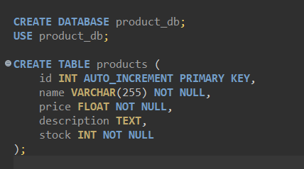
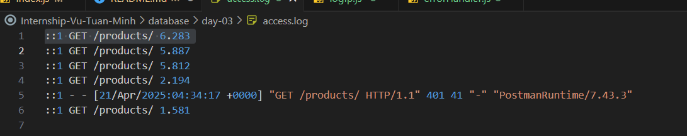
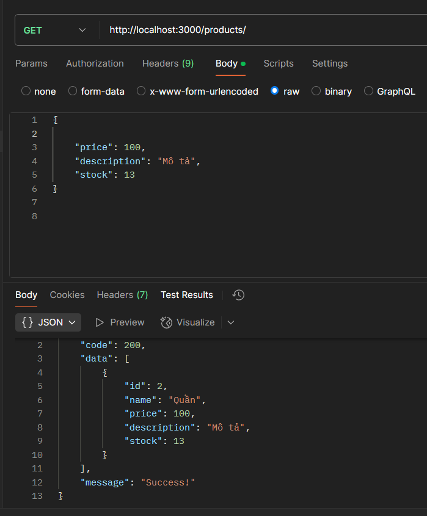
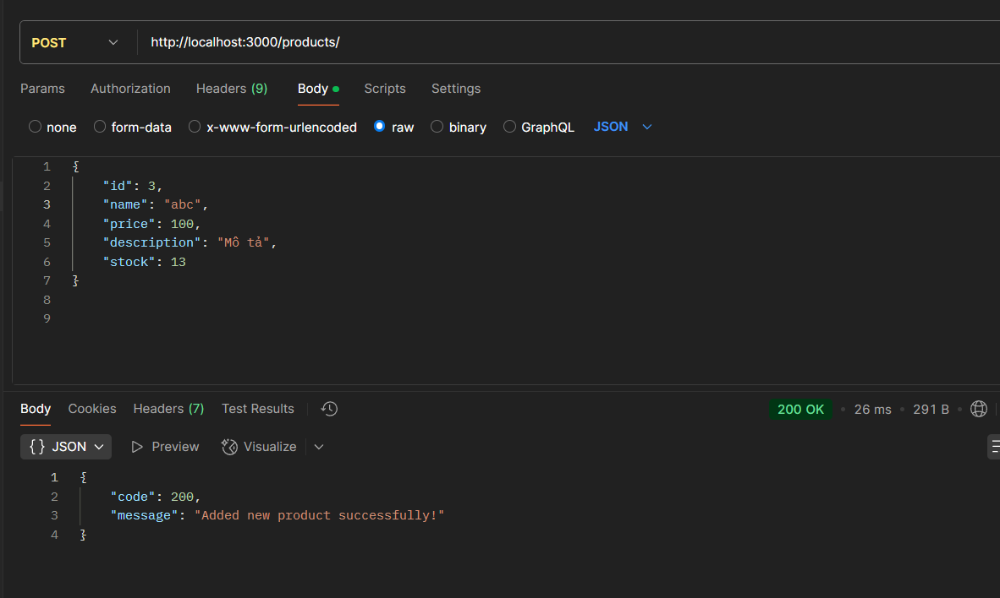
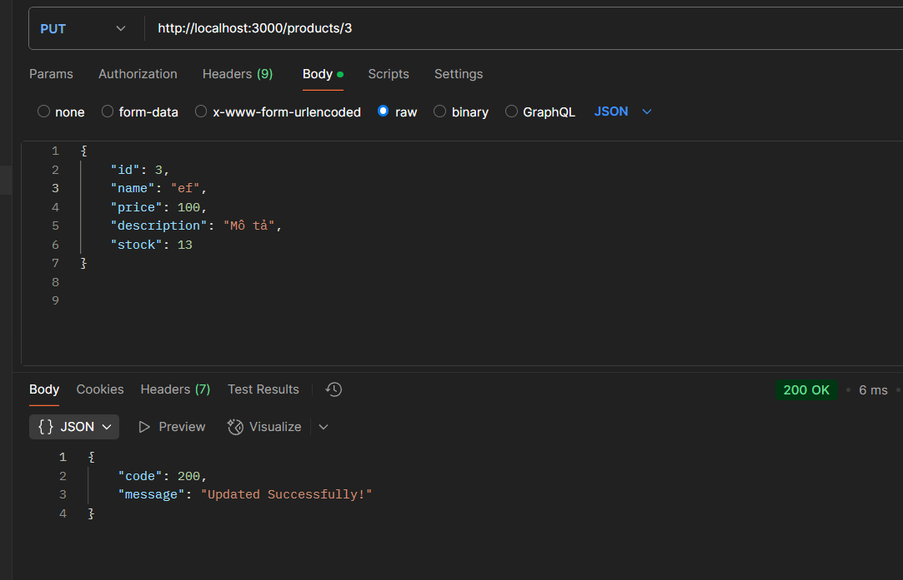
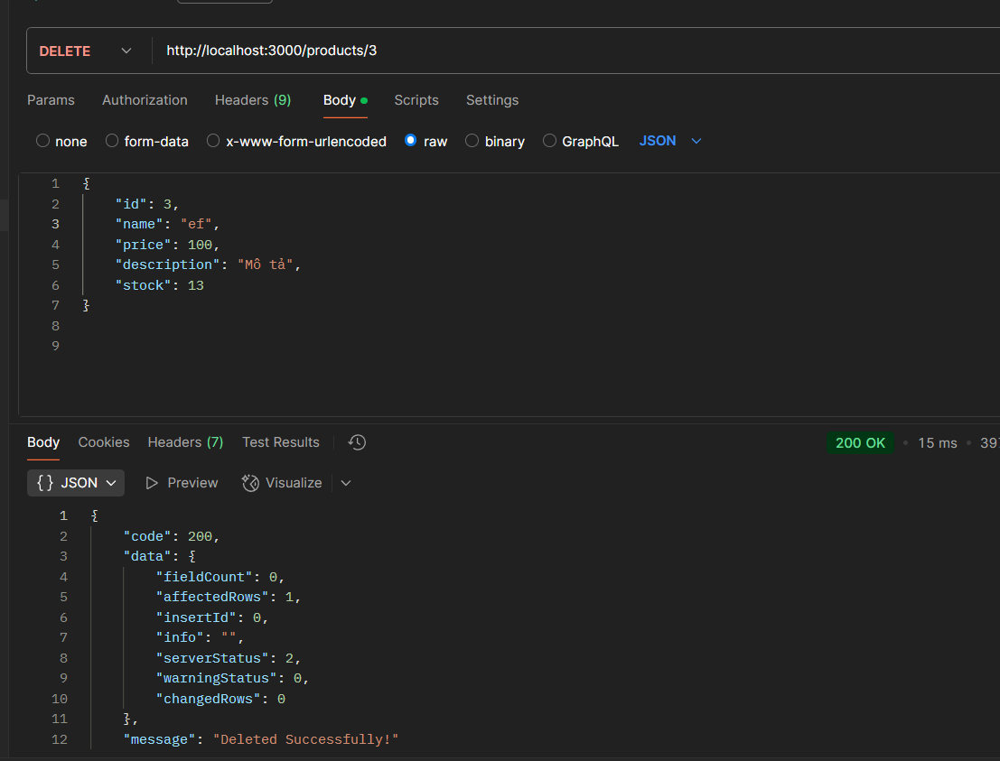
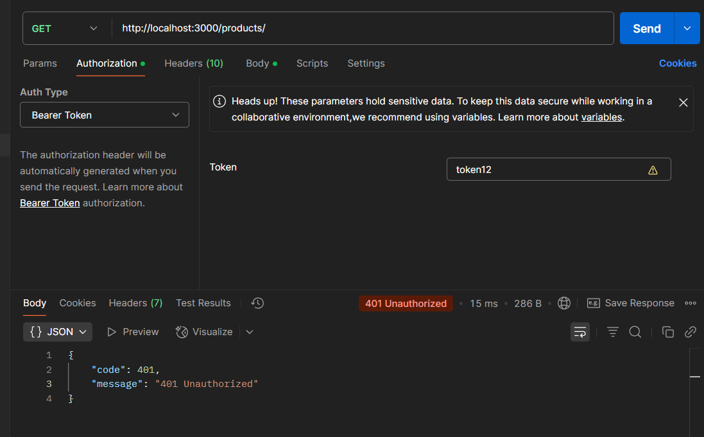

# Product management
## Cách tải project:
- Bật termial chạy: git clone https://github.com/tuanminh9704/Internship-Vu-Tuan-Minh/tree/master/nodejs/day-03

## Cách cài đặt project
 - Vào các tool phổ biến của mysql như (Mysql Workbench, DBeaver) tạo một file script mới và chạy các câu lệnh sau:

 
 - Sau khi thêm dự án vào VsCode bật terminal và chạy npm install để thêm các thư viện cần thiết 
 - Vào thư mục config và cấu hình lại db theo đúng các trường db của mình bao gồm host, root, password, database

 
 - Chạy câu lệnh node index.js để chạy dự án 

 -Bật terminal chạy file firstSeed

 # Kiểm thử các API trên Post Man trên post man:
 GET: 
 POST: 
 PUT: 
 DELETE: 

 Sai token: 
 

 Log ra file: 
 

