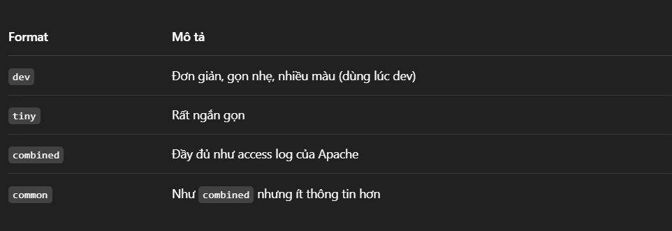

# Middleware, Error Handling, Logger trong Express.js
## Mục tiêu
### Hiểu rõ Middleware là gì, cách hoạt động và ứng dụng thực tế
### Biết cách xử lý lỗi đúng chuẩn RESTful API
### Làm quen với logger: console.log và thư viện Morgan

## 1. Middleware là gì?
### Middleware là các hàm có quyền truy cập vào đối tượng yêu cầu ( req), đối tượng phản hồi ( res) và hàm trung gian tiếp theo trong chu kỳ yêu cầu-phản hồi của ứng dụng. Hàm trung gian tiếp theo thường được biểu thị bằng một biến có tên là next.  
  

### Flow:
Request ➡️ Middleware 1 ➡️ Middleware 2 ➡️ Route Handler ➡️ Response

### Các loại middleware phổ biến

### Ví dụ về ứng dụng của middleware 

## 2. Error Handling chuẩn RESTful
### Error Handling chuẩn RESTful là cực kỳ quan trọng để client dễ debug, dễ hiểu và giúp API rõ ràng, dễ dùng giúp status code rõ ràng, thông điệp lỗi cụ thể, dữ liệu phản hồi response có một cấu trúc cụ thể, phân biệt rõ ràng giữa lỗi phía client và server 

### * Cấu trúc response lỗi chuẩn RESTful
### {
        "status": 400,
        "error": "Bad Request",
        "message": "Tên sản phẩm là bắt buộc",
        "timestamp": "2025-04-21T09:34:12.123Z",
        "path": "/api/products"
    }

## 3. Logger – Ghi log để dễ debug

## Cách 1: Cách cơ bản:
### console.log(req.method, req.url);

## Cách 2: Sử dụng Morgan:

### 2.1 Ứng dụng
### morgan là middleware cho Express dùng để:
✅ Ghi log chi tiết các request HTTP (method, status, thời gian, v.v.)
✅ Giúp dev dễ debug request trong quá trình phát triển
✅ Có thể tuỳ chỉnh ghi log vào console hoặc file

### 2.2 Các format log có sẵn

### kết hợp Morgan + Error handling

### Ví dụ hoàn chỉnh 

### Gợi ý nâng cao: 

