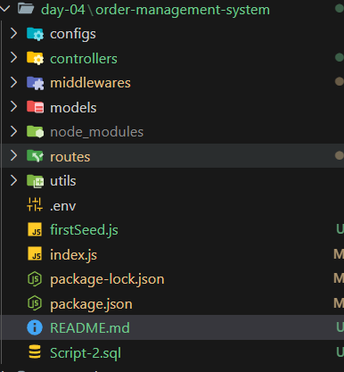

# Mini Project – Order Management System
## Đây là project về quản lý đơn hàng bao gồm các tính năng như:
-  CRUD sản phẩm, tìm kiếm theo tên, phân trang, lọc theo category, 
- Phân quyền user và admin
- Đặt hàng, xử lý status đơn hàng
- Login và register

## CÔng nghệ sử dụng
- Node.js + Express.js
- MySQL (qua mysql2)
- JWT cho authentication
- Logger: Morga
- Postman để test API
## Tool: 
- VSCode
- Postman
- DBeaver
## Cấu trúc thư mục

## Cách khởi động project
Yêu cầu phải có các tool như sau: vsCode, PostMan, DBeaver(Mysql Workbench,...);
- Đầu tiên thêm Project vào VSCode
- Sau đó mở file Script-2.sql trong DBeaver hoặc các tool khác và chạy các câu lệnh trong file này
- Bật terminal
- Chạy câu lệnh cd order-management-system
- chạy npm install để cài các thư viện cần thiết
- Sau đó chạy node seed.js để tải các tài nguyên
- Sau đó chạy npm start để khởi động 
