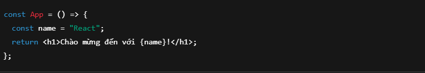
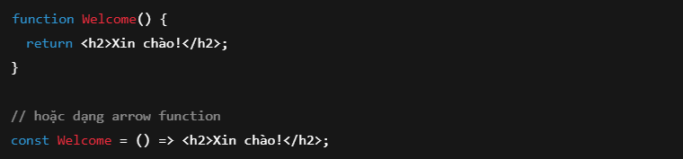
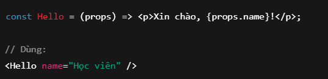
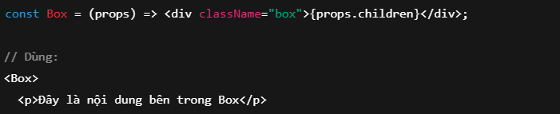
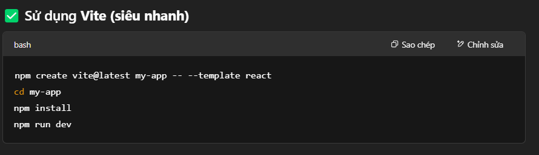
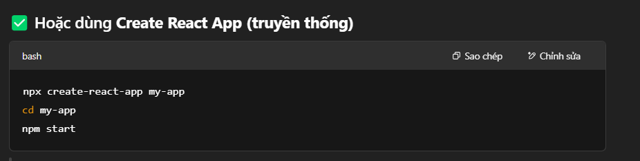
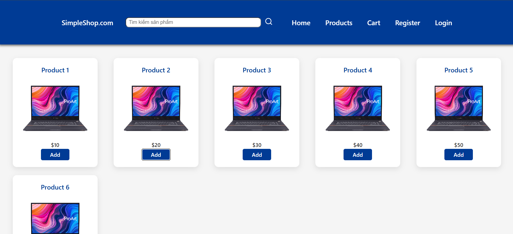
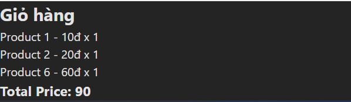

# Lý thuyết day 5
---------------------------------------------
## Nội dung chính
- Tổng quan ReactJS
- JSX syntax
- Functional Component
- Props / Children
- Setup project React 
- Code Style Convention
-----------------------------------------------
## Tổng quan về ReactJS
ReactJS là một thư viện JavaScript dùng để xây dựng giao diện người dùng (UI) theo dạng component-based (dựa trên thành phần). Nó giúp bạn xây dựng các ứng dụng web hiện đại, dễ mở rộng và dễ bảo trì.

Đặc điểm chính:
- Component: React chia giao diện thành các khối nhỏ (component) độc lập.

- Virtual DOM: Tăng tốc hiệu suất render giao diện.

- One-way Data Binding: Dữ liệu chảy một chiều từ cha → con → giúp kiểm soát tốt hơn.

- Hooks: Cho phép dùng state, lifecycle mà không cần class.
## JSX syntax

JSX không bắt buộc nhưng rất phổ biến vì dễ viết và dễ đọc hơn React.createElement().

📌 Lưu ý:

JSX phải đóng tag đầy đủ 

Một component phải return 1 khối duy nhất, nên thường bọc trong thẻ div hoặc <>...</> (fragment).
## Functional Component

🎯 Ưu điểm:

- Ngắn gọn hơn class component.

- Tích hợp tốt với hooks.

- Được khuyến khích sử dụng hiện nay.

## Props & Children
Props (Properties): 
Là cách truyền dữ liệu từ component cha → con.

Children: 
Là nội dung nằm giữa thẻ mở và thẻ đóng của một component.

## Setup Project React

## Code Style Convention
Để viết code React chuẩn, dễ đọc, dễ bảo trì, bạn nên theo các quy ước sau:

🧹 Quy tắc cơ bản:
- Tên component viết hoa: MyComponent, ProductCard

- Tách component ra file riêng nếu tái sử dụng.

- Luôn format code (dùng Prettier).

- Tránh viết logic dài trong JSX → nên tách ra function riêng.

## Demo

## Thêm vào giỏ hàng

------------------------------------------------
## Cách chạy dự án: 
- Bật terminal dự án lên
- Chạy npm install để cài các thư viện cần thiết
- Chạy npm run dev để chạy trương trình
- Bật google vào http://localhost:5173

