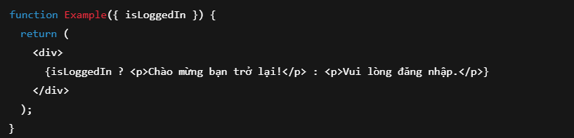

# Day 12: State, Event, Conditional Rendering, List & Key, Form Handling
## Nội dung chính
- useState Hook
- Event Handling trong React
- Conditional Rendering
- Render List, sử dụng key
- Form input, handle change

## 1, useState Hook
- useState là một Hook cho phép component ghi nhớ dữ liệu và cập nhật lại giao diện khi dữ liệu thay đổi.

- Khi bạn thay đổi state, component sẽ render lại.
Ví dụ: 

## 2, Event Handling trong React
- Bắt sự kiện như click, change, submit… trong React, tương tự HTML nhưng dùng camelCase (onClick, onChange, onSubmit,...).

- Truyền một hàm vào sự kiện.
Ví dụ: 

## 3, Conditional Rendering
- Hiển thị giá trị khác nhau tùy vào nội dung của biến

## 4, Render List + Sử dụng key
- Khi lặp danh sách (map), mỗi phần tử phải có key để React tối ưu việc cập nhật
- key nên là id duy nhất nếu có (hạn chế dùng index nếu list có thể thay đổi thứ tự).

## 5, Form Input + Handle Change
- Khi nhập liệu (input), cần lưu giá trị vào state và cập nhật mỗi lần người dùng gõ.

# Tóm Tắt

