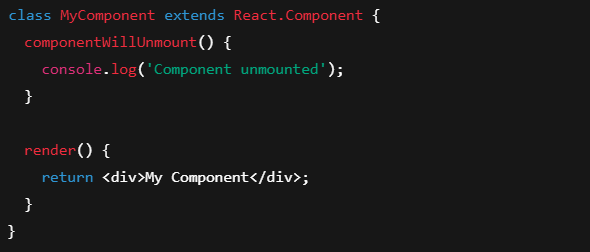

# Day 13: useEffect, Lifecycle cơ bản
## Nội dung chính
- useEffect Hook
- Lifecycle trong Function Component
- Call API (fetch/axios)

## 1, useEffect Hook
useEffect là một hook trong React giúp bạn thực hiện các tác vụ phụ (side effects) trong các component. Nó có thể được sử dụng để xử lý các hành động như gọi API, cập nhật DOM, hoặc thực hiện các tác vụ khi component được render hoặc cập nhật.

```
useEffect(() => {
  // Các tác vụ phụ (side effect) sẽ được thực hiện ở đây

  return () => {
    // Clean up (xử lý khi component unmount hoặc khi effect thay đổi)
  };
}, [dependencies]);

```

Giải thích:
useEffect nhận vào hai tham số:

Một hàm callback chứa các tác vụ cần thực hiện.

Một mảng dependencies (không bắt buộc), chỉ định những giá trị mà useEffect phụ thuộc vào. Nếu mảng này thay đổi, useEffect sẽ được gọi lại. Nếu mảng rỗng, useEffect chỉ chạy một lần khi component được mount.

Ví dụ:
1. Chạy khi component được mount:


2. Chạy khi một giá trị trong state hoặc props thay đổi:

3. Clean up (dọn dẹp) khi component unmount hoặc khi effect thay đổi:


## 2, Lifecycle trong Function Component
Trong React, các lifecycle methods (phương thức vòng đời) được sử dụng để kiểm soát hành vi của component trong suốt quá trình sống của nó. Trước đây, trong các class components, chúng ta sử dụng các phương thức vòng đời như componentDidMount, componentDidUpdate, và componentWillUnmount. Tuy nhiên, khi sử dụng function components, chúng ta có thể thay thế các phương thức này bằng các hooks, đặc biệt là useEffect
1. ComponentDidMount (Chạy khi component được mount)
Đây là phương thức lifecycle chạy một lần khi component được render lần đầu tiên.

### 1. ComponentDidMount (Chạy khi component được mount)
Đây là phương thức lifecycle chạy một lần khi component được render lần đầu tiên.


### 2. ComponentDidUpdate (Chạy khi component được cập nhật)
Phương thức này chạy mỗi khi props hoặc state thay đổi, tương đương với việc gọi useEffect khi có sự thay đổi trong dependencies


### 3. ComponentWillUnmount (Chạy khi component unmount)
Phương thức này được gọi khi component bị hủy bỏ khỏi DOM, thường được dùng để dọn dẹp các tác vụ như hủy bỏ các subscriptions, timers, hoặc listener.


### Tóm tắt
Trong function components, bạn có thể thay thế hầu hết các lifecycle methods của class components bằng cách sử dụng useEffect. Mỗi lifecycle method của class component có thể được tái hiện với useEffect và cách cấu hình dependencies của nó.

## 3, Call API (fetch/axios)
### 1. Sử dụng fetch để gọi API
fetch là một API có sẵn trong JavaScript để thực hiện các yêu cầu HTTP. Dưới đây là ví dụ sử dụng fetch trong React để gọi API và xử lý dữ liệu.

Ví dụ sử dụng fetch:

```
import React, { useEffect, useState } from 'react';

const FetchExample = () => {
  const [data, setData] = useState(null);
  const [loading, setLoading] = useState(true);
  const [error, setError] = useState(null);

  useEffect(() => {
    fetch('https://jsonplaceholder.typicode.com/posts')  // URL API
      .then((response) => response.json())  // Chuyển đổi response thành JSON
      .then((data) => {
        setData(data);  // Lưu dữ liệu vào state
        setLoading(false);  // Đặt loading thành false
      })
      .catch((error) => {
        setError(error);  // Lưu lỗi nếu có
        setLoading(false);
      });
  }, []); // Chạy 1 lần khi component mount

  if (loading) {
    return <div>Loading...</div>;
  }

  if (error) {
    return <div>Error: {error.message}</div>;
  }

  return (
    <div>
      <h1>Fetched Data</h1>
      <ul>
        {data.map((item) => (
          <li key={item.id}>{item.title}</li>
        ))}
      </ul>
    </div>
  );
};

export default FetchExample;

```

### Giải thích:
- useEffect: Sử dụng useEffect để thực hiện yêu cầu HTTP khi component được mount.

- fetch: Thực hiện gọi API tới endpoint 'https://jsonplaceholder.typicode.com/posts'.

- response.json(): Chuyển đổi dữ liệu nhận được thành định dạng JSON.

- setState: Cập nhật state với dữ liệu hoặc lỗi.

- loading: Dùng để hiển thị trạng thái đang tải.

### 2. Sử dụng axios để gọi API
axios là một thư viện HTTP phổ biến giúp dễ dàng làm việc với các yêu cầu HTTP. axios cung cấp nhiều tính năng bổ sung so với fetch, như tự động chuyển đổi JSON, hỗ trợ các lỗi tốt hơn, và dễ dàng cấu hình.

Cài đặt axios:
Để sử dụng axios, bạn cần cài đặt nó trước:

```
npm install axios
```

Ví dụ: 
```
import React, { useEffect, useState } from 'react';
import axios from 'axios';

const AxiosExample = () => {
  const [data, setData] = useState(null);
  const [loading, setLoading] = useState(true);
  const [error, setError] = useState(null);

  useEffect(() => {
    axios.get('https://jsonplaceholder.typicode.com/posts')  // Gọi API
      .then((response) => {
        setData(response.data);  // Lưu dữ liệu vào state
        setLoading(false);  // Đặt loading thành false
      })
      .catch((error) => {
        setError(error);  // Lưu lỗi nếu có
        setLoading(false);
      });
  }, []);  // Chạy 1 lần khi component mount

  if (loading) {
    return <div>Loading...</div>;
  }

  if (error) {
    return <div>Error: {error.message}</div>;
  }

  return (
    <div>
      <h1>Fetched Data</h1>
      <ul>
        {data.map((item) => (
          <li key={item.id}>{item.title}</li>
        ))}
      </ul>
    </div>
  );
};

export default AxiosExample;

```

Giải thích:
- axios.get: Gửi yêu cầu GET tới API endpoint.

- response.data: Dữ liệu trả về từ API sẽ được chứa trong data của đối tượng response.

- setState: Cập nhật state với dữ liệu hoặc lỗi.

- loading: Cung cấp trạng thái khi đang tải dữ liệu từ API.


Demo: 

