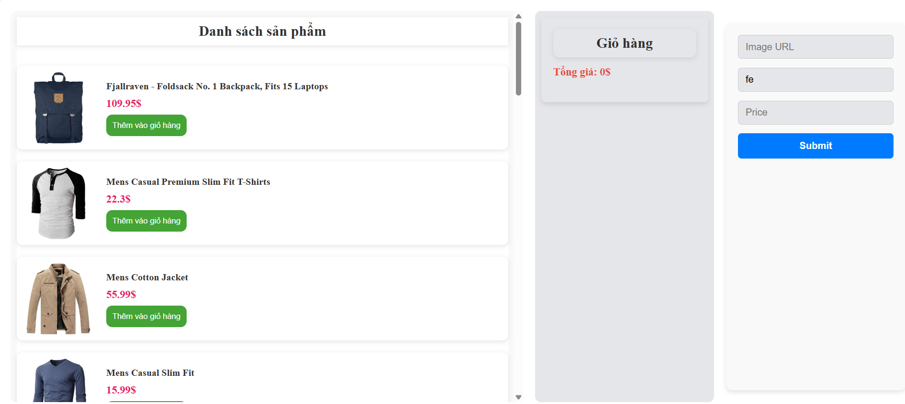

# Mini Project: Xây dựng App Quản lý Product & Giỏ hàng
## Công nghệ sử dụng: 
- Vite + ReactJS
- scss 
## Mô tả chức năng: 
## Bao gồm các chức năng như: 
-  Xem danh sách sản phẩm
- Thêm sản phẩm vào giỏ hàng
- Tổng tiền trong giỏ hàng
- Tăng giảm số lượng sản phẩm trong giỏ hàng
- Thêm sản phẩm mới vào danh sách sản phẩm
## Cách chạy dự án:
- Bật terminal chạy:
```
cd product-management-app

```
- Chạy `npm install` để tải các thư viện cần thiết
- Chạy `npm run dev` để chạy dự án
- Bật google vào đường dẫn http://localhost:5173/
## Demo:

