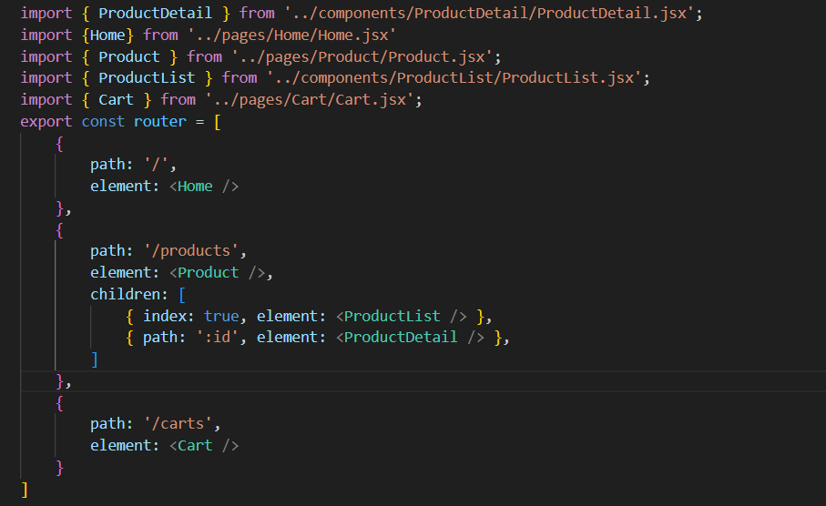
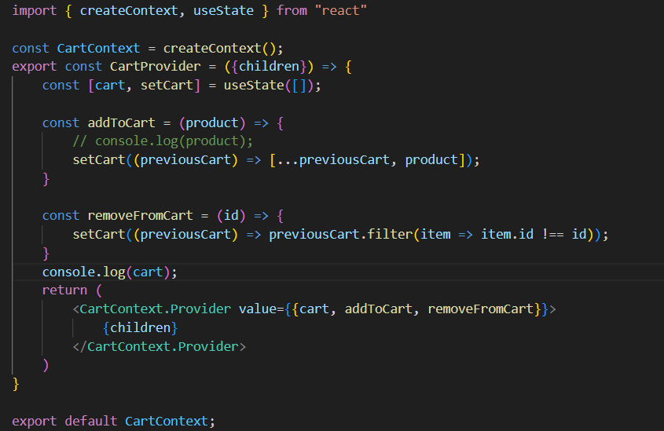

# Day 16: React Router + useContext
## Nội dung chính
- Giới thiệu SPA, router dom v6
- Nested Routes, Dynamic Route
- Context API - Global State

## 1. Giới thiệu SPA, router dom v6
## Giới thiệu SPA
✅ Định nghĩa:
- SPA là một ứng dụng web chỉ sử dụng 1 trang HTML duy nhất, và nội dung được thay đổi động bằng JavaScript mà không cần tải lại toàn bộ trang từ server.
✅ Đặc điểm chính:
- Không tải lại trang khi chuyển route.

- Tải dữ liệu từ server (API) bằng JavaScript.

- Cải thiện trải nghiệm người dùng (nhanh hơn, mượt hơn).

- Dễ kết hợp với React, Vue, Angular...

## router dom v6
- Tạo đường dẫn URL khác nhau (VD: /, /about, /products/:id)

- Hiển thị các component tương ứng với từng đường dẫn

- Hỗ trợ Nested Routes, Layout, Redirect, Navigation

## 2. Nested Routes, Dynamic Route
## Nested Routes
Là cách tổ chức các route con bên trong route cha, giúp:

- Tái sử dụng layout chung (header, sidebar, navbar…)

- Cấu trúc gọn gàng hơn
Ví dụ: 


## Dynamic Route
Là Router có truyền thêm các tham số động 
Ví dụ: 
```
http://localhost:5173/products/2

``` 

## Context API - Global State
## Context API 
Context API giúp tạo ra một cơ chế chia sẻ state toàn cục mà không phải qua từng props của từng component.

- Provider: Cung cấp dữ liệu cho các component con.

- Consumer: Tiêu thụ dữ liệu từ context.

- useContext Hook: Một cách dễ dàng để tiêu thụ context trong function component.
VÍ dụ: 



