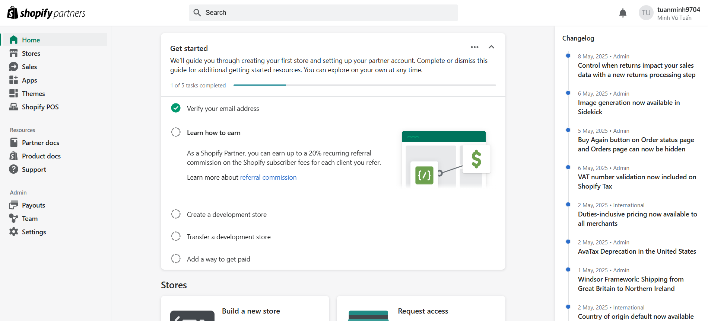

# Day 21: Tổng quan Shopify & Shopify App

## Nội dung chính
- Shopify là gì? Mô hình hoạt động
- Các loại Shopify App (Public, Private, Custom)
- Shopify Partner, Dev Store, Shopify App Store

---
# Nội dung: 

## 1, Shopify là gì? Mô hình hoạt động 

## 1.1 Shopify là gì

Shopify là một nền tảng thương mại điện tử (e-commerce platform) cho phép người dùng tạo và quản lý cửa hàng online mà không cần nhiều kiến thức lập trình. Shopify hỗ trợ:

- Thiết kế website bán hàng.

- Quản lý sản phẩm, đơn hàng, khách hàng.

- Tích hợp thanh toán (Stripe, PayPal...).

- Tối ưu cho cả desktop và mobile.

## 1.2 Mô hình hoạt động
Shopify hoạt động theo mô hình SaaS (Software as a Service):

1. Người bán (merchants) đăng ký tài khoản, chọn gói dịch vụ.

2. Họ sử dụng công cụ của Shopify để:

- Tạo cửa hàng.

- Tải sản phẩm lên.

- Cấu hình thanh toán, vận chuyển.

3. Người dùng truy cập cửa hàng để đặt mua hàng hóa.

4.Shopify xử lý thanh toán, gửi thông báo đơn hàng, v.v.

👉 Ngoài ra, người bán có thể mở rộng tính năng của cửa hàng bằng cách cài đặt Shopify Apps.

---

## 2, Các loại Shopify App (Public, Private, Custom)

## 2.1 Shopify app public
Được đăng lên Shopify App Store.

Có thể dùng bởi bất kỳ merchant nào.

Phải tuân thủ các yêu cầu nghiêm ngặt về bảo mật, review, OAuth v.v.

Ví dụ: Oberlo, Klaviyo, Printful...

## 2.2 Custom App
Dành cho một merchant cụ thể.

Không cần submit lên App Store.

Có thể cài trực tiếp vào store thông qua link install.

Phù hợp khi cần tính năng chuyên biệt cho một khách hàng.

## 2.3 Private (cũ, sắp bị loại bỏ)
Dành cho nội bộ hoặc dùng thử.

Được tạo và cấu hình trực tiếp từ Admin store.

Không hỗ trợ OAuth, ít bảo mật hơn.

Shopify đang khuyến nghị chuyển sang Custom App.

---

## 3, Shopify Partner, Dev Store, Shopify App Store

## 3.1 Shopify Partner

Shopify Partner là chương trình dành cho:

- Developer.

- Agency.

- Freelancer.

- Ai muốn phát triển theme, app hoặc store cho khách hàng.

Quyền lợi:

- Truy cập Dev Store miễn phí (để test, phát triển).

- Nhận phần trăm hoa hồng nếu giới thiệu người dùng mới.

- Dễ dàng publish app lên Shopify App Store.

## 3.2 Dev Store

Dev Store là các cửa hàng ảo được tạo ra bởi Shopify Partner:

- Dùng để thiết kế, phát triển app, test theme, thử nghiệm.

- Không bị tính phí.

- Không dùng để bán hàng thật.

## 3.3 Shopify App Store

Là "chợ ứng dụng" chính thức của Shopify:

- Nơi merchant tìm kiếm và cài app.

- App có thể miễn phí, freemium hoặc trả phí.

- Yêu cầu app phải được Shopify duyệt kỹ lưỡng (bảo mật, review, tuân thủ API v.v.).

# Bài tập

1. Đăng ký Shopify Partner Account: 

2. Tạo Dev Store đầu tiên:

3. Khám phá Admin Dashboard và các tính năng

