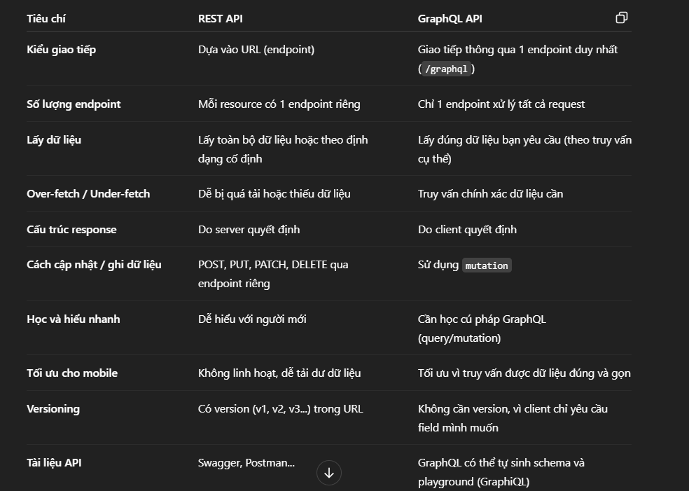
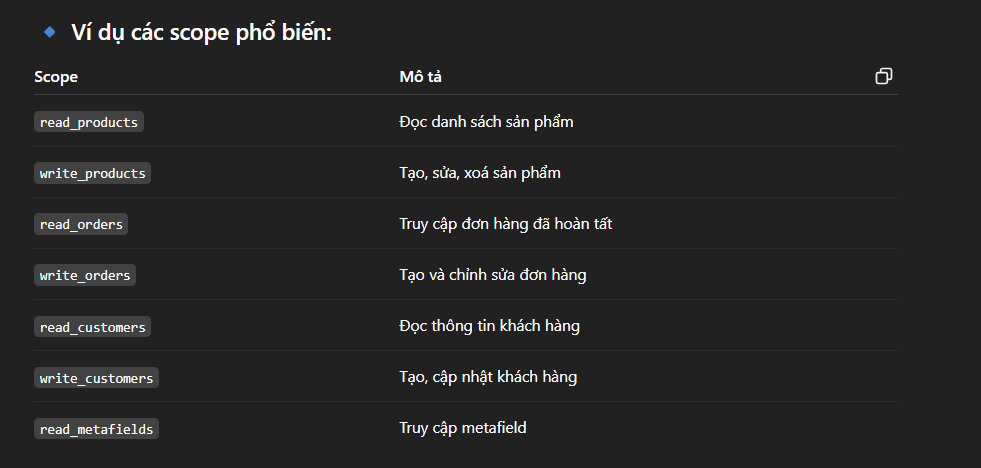
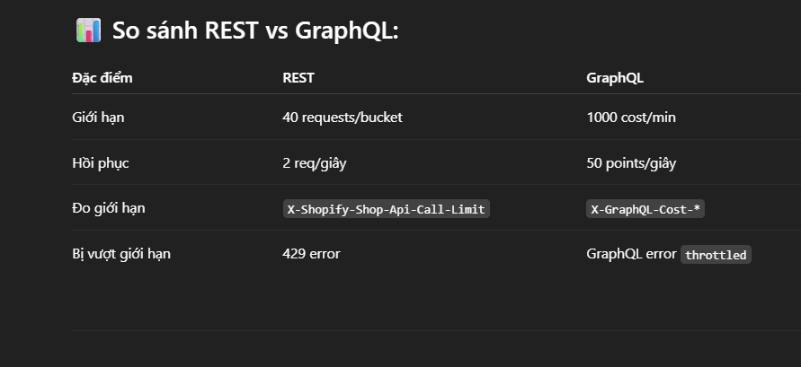
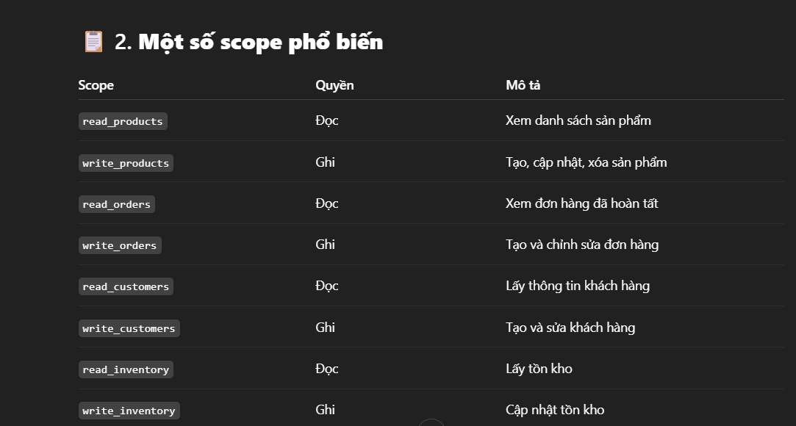
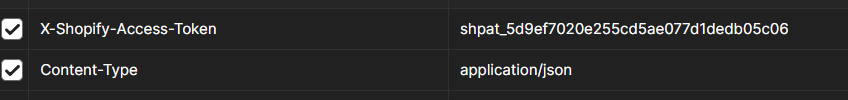
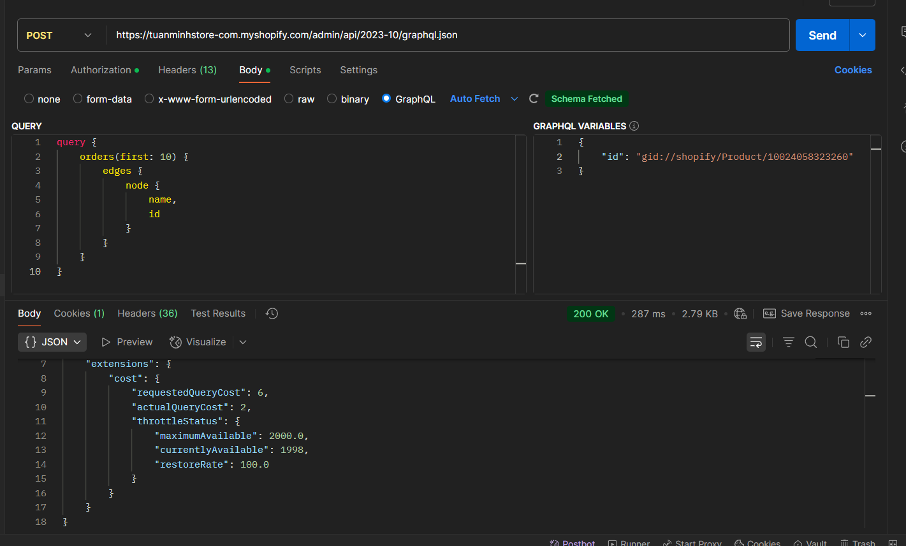
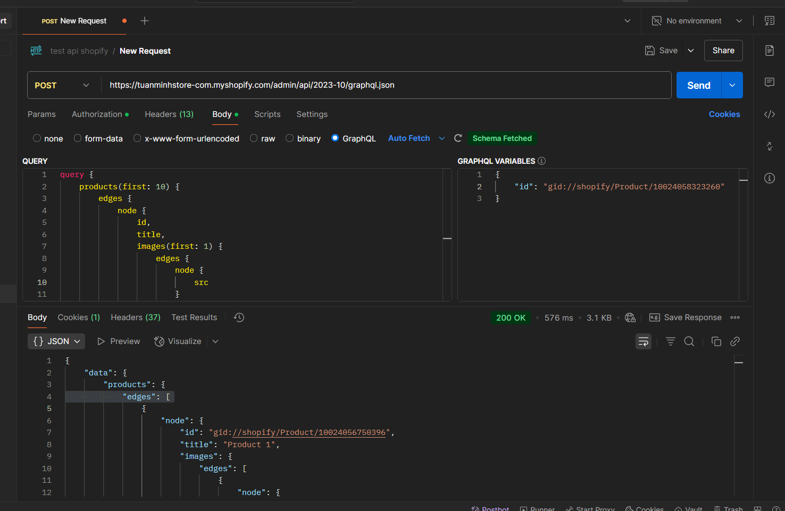
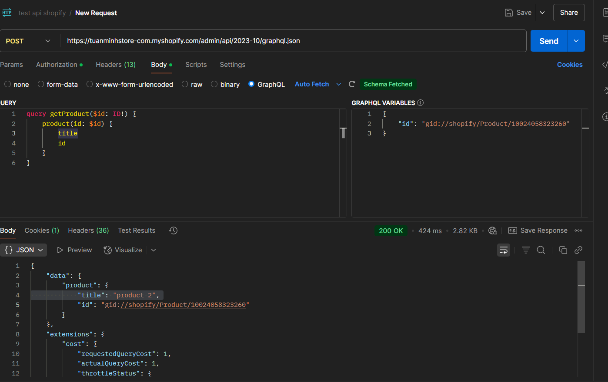

# Day 22: Shopify API Overview (REST - GraphQL)
## Nội dung chính
- REST API vs GraphQL API
- Giới thiệu các API quan trọng: Product API, Customer API, Order API
- Tìm hiểu các API mà Shopify cung cấp cho App
- Nắm được các giới hạn (rate limit, scope) khi gọi API
- Phân tích REST API vs GraphQL API
- Hiểu về Rate Limit và tính toán limit
- Phân quyền scope, xin đúng quyền API
- Các lỗi thực tế khi phát triển app:
- Vượt limit
- Thiếu scope
- Lỗi API khi thiếu dữ liệu
- Xử lý lỗi và retry logic
- Hiểu OAuth flow cơ bản để lấy access token
- Giới thiệu Postman test Shopify API
## Bài tập
- Test API trên Postman:
- Lấy danh sách products
- Lấy thông tin 1 product
- Tìm hiểu OAuth Flow để hiểu cơ chế token

1. REST API vs GraphQL API



## 2. Giới thiệu các API quan trọng: Product API, Customer API, Order API

2.1 Product API
Product API dùng để quản lý tất cả thông tin liên quan đến sản phẩm trong cửa hàng Shopify.
Chức năng chính:
```
Tạo sản phẩm mới (POST /admin/api/2023-04/products.json)

Cập nhật sản phẩm (PUT)

Xoá sản phẩm

Lấy danh sách sản phẩm

Quản lý biến thể sản phẩm (variants), hình ảnh (images), tag, collections

```

Ví dụ: 
REST API: 
```
GET /admin/api/2023-04/products.json
```

GraphQL: 
```
query {
  products(first: 10) {
    edges {
      node {
        id
        title
        descriptionHtml
      }
    }
  }
}
```

2.2 Customer API
Customer API cho phép bạn quản lý khách hàng trong cửa hàng, thường dùng trong các ứng dụng quản lý người dùng, marketing, loyalty,...

Chức năng chính: 
```
Tạo khách hàng mới

Tìm kiếm khách hàng theo email

Cập nhật / xoá khách hàng

Lấy lịch sử đơn hàng của khách hàng
```

Ví dụ: 
REST API: 
```
GET /admin/api/2023-04/customers.json
```
GRAPHQL: 
```
query {
  customers(first: 10) {
    edges {
      node {
        id
        firstName
        email
      }
    }
  }
}

```
2.3 Order API
Order API dùng để quản lý các đơn hàng phát sinh trong cửa hàng Shopify.
Chức năng chính:
```
Lấy danh sách đơn hàng

Tạo đơn hàng thủ công

Cập nhật trạng thái đơn hàng

Lấy chi tiết sản phẩm trong đơn hàng, khách hàng, thanh toán, shipping
```
Ví dụ: 
REST API: 
```
GET /admin/api/2023-04/orders.json
```
GRAPHQL: 
```
query {
    orders(first: 10) {
        edges {
            node {
                name,
                id
            }
        }
    }
}
```

---
## Tìm hiểu các API mà Shopify cung cấp cho App

🧩 1. Admin API (REST & GraphQL)
Dùng để truy cập và quản lý dữ liệu cửa hàng như: sản phẩm, đơn hàng, khách hàng, discount, fulfillment...

🔹 Chia thành 2 loại:
REST Admin API: Truy vấn thông thường qua endpoint (JSON)

GraphQL Admin API: Truy vấn nhanh hơn, chính xác hơn, chỉ lấy dữ liệu cần

🔹 Dùng để:
Lấy sản phẩm, đơn hàng, khách hàng

Tạo và chỉnh sửa dữ liệu cửa hàng

Gắn webhook, metafield...

📘 Docs: https://shopify.dev/docs/api/admin

🛠 2. Storefront API
Cho phép bạn tạo trải nghiệm bán hàng tùy chỉnh (headless commerce) bằng cách truy cập dữ liệu sản phẩm, giỏ hàng, checkout... mà không cần dùng Shopify Theme.

🔹 Dùng để:
Tạo trang bán hàng riêng (không dùng Liquid/Theme)

Tạo giỏ hàng tùy chỉnh

Thực hiện mua hàng không qua storefront gốc

📘 Docs: https://shopify.dev/docs/api/storefront

🧾 3. Checkout API (chỉ cho Plus)
Cho phép tùy chỉnh quy trình thanh toán đối với các cửa hàng Shopify Plus.

Không dành cho tất cả app – chỉ Plus merchants mới dùng được

Shopify đang dần chuyển sang hỗ trợ qua các extension mới

🎣 4. Shopify Webhooks
Cho phép app nhận sự kiện theo thời gian thực (event-driven), ví dụ:

Khi có đơn hàng mới (orders/create)

Khi sản phẩm được cập nhật

Khi app bị gỡ khỏi cửa hàng

🔹 Webhook hoạt động qua:
HTTP POST đến endpoint app đăng ký

Có thể đăng ký qua Admin API hoặc dashboard

📘 Docs: https://shopify.dev/docs/api/admin-rest/2023-10/resources/webhook

📦 5. Cart API
Dùng để xử lý giỏ hàng (cart) thông qua Storefront API hoặc theme. Hữu ích khi bạn muốn thay đổi hành vi mua hàng.

📘 Docs: https://shopify.dev/docs/api/storefront/latest/objects/Cart

🔐 6. Authentication API
Cho phép app xác thực truy cập vào cửa hàng thông qua:

OAuth 2.0 (bắt buộc với public app)

API key/secret (dành cho private app cũ)

📘 Docs: https://shopify.dev/docs/apps/auth

🧬 7. Metafield API
Giúp bạn lưu dữ liệu tuỳ chỉnh (custom data) cho sản phẩm, khách hàng, đơn hàng,... ví dụ: thành phần sản phẩm, màu sắc riêng, v.v.

📘 Docs: https://shopify.dev/docs/api/admin-graphql/latest/objects/Metafield

---

## Nắm được các giới hạn (rate limit, scope) khi gọi API

## Rate limit:
Shopify áp dụng giới hạn để bảo vệ hệ thống khỏi lạm dụng tài nguyên.

a. Admin API – REST
Giới hạn: 40 requests / giây / shop

Cách hoạt động: hệ thống cấp một "leaky bucket" với dung lượng 40 và tốc độ hồi phục 2 request mỗi giây.

Nếu vượt quá → trả về HTTP 429 Too Many Requests

📘 Cách kiểm tra:

Dựa vào header phản hồi:

```
X-Shopify-Shop-Api-Call-Limit: 10/40
```

b. Admin API – GraphQL
Giới hạn: Tính theo "chi phí truy vấn (query cost)", không phải số lần gọi

Mỗi app có 1000 "cost points" mỗi phút

Truy vấn phức tạp hơn tốn nhiều điểm hơn (ví dụ: truy vấn nested dữ liệu)

📘 Header trả về:
```
X-GraphQL-Cost-Include-Fields: true
X-GraphQL-Cost-Actual-Cost: 50
X-GraphQL-Cost-Requested-Cost: 50
```
c. Storefront API
Giới hạn: 60 seconds → tối đa 60 queries / minute / IP

Tuy nhiên mỗi truy vấn cũng tính cost như GraphQL (dựa trên độ phức tạp)

## API Scope – Quyền truy cập dữ liệu
App cần khai báo rõ scope khi cài đặt để được cấp quyền dùng các endpoint tương ứng.


📘 Scope được định nghĩa trong URL OAuth khi cài đặt app:
```
https://{shop}.myshopify.com/admin/oauth/authorize?scope=read_products,write_orders
```
---

## Hiểu về Rate Limit và tính toán limit
Rate Limit là giới hạn số lượng request mà app của bạn được phép gửi đến Shopify trong một khoảng thời gian cụ thể. Điều này giúp:

- Tránh app spam Shopify server

- Bảo đảm hiệu suất chung của toàn hệ thống

- Hạn chế app gây ảnh hưởng tới cửa hàng khác

Cách tính rate limit
Bạn có thể gửi tối đa 40 requests liên tiếp, và sau đó cứ mỗi giây, bạn được "nạp lại" 2 request.

Ví dụ nếu gửi 20 request liên tiếp
```
X-Shopify-Shop-Api-Call-Limit: 20/40
=> còn lại 20 request
```

Nếu gửi thêm liên tiếp 20 request nữa 
```
X-Shopify-Shop-Api-Call-Limit: 40/40
=> còn lại 0 request
```
Nếu gửi thêm 1 request sẽ lập tức bị lỗi
```
HTTP 429 Too Many Requests
→ Giải pháp: Đợi 1 giây, bucket hồi phục 2 request → bạn có thể tiếp tục gửi.
```

✅ Mẹo tính toán thời gian chờ:
Nếu bạn đã dùng hết 40/40, bạn cần đợi:
```
T = số request muốn gửi thêm / tốc độ hồi phục
T = 10 / 2 = 5 giây
```

GraphQL Admin API – Cách tính cost
Shopify GraphQL không tính theo số lần gọi mà theo cost points.

✅ Giới hạn:
1000 cost points / phút / app / shop

Tốc độ hồi phục: 50 points / giây

📘 Ví dụ:
Một truy vấn đơn giản:
```
{
  shop {
    name
  }
}
→ tốn khoảng 1–2 points
```
Một truy vấn phức tạp:

```
{
  products(first: 100) {
    edges {
      node {
        title
        variants(first: 50) {
          edges {
            node {
              price
            }
          }
        }
      }
    }
  }
}
→ có thể tốn 100–300 points tùy mức độ lồng nhau
```
✅ Cách xem cost truy vấn:
Shopify trả về header:

```
X-GraphQL-Cost-Actual-Cost: 145
X-GraphQL-Cost-ThrottleStatus: {"currentlyAvailable":855,"restoreRate":50.0}
```
💡 Nếu cost của bạn gần 1000 → app phải chờ vài giây trước khi gọi tiếp.

✅ Tính thời gian chờ:
Nếu bạn chỉ còn 100 cost mà truy vấn kế tiếp cần 200:

```
cost thiếu = 200 - 100 = 100
T = cost thiếu / restoreRate = 100 / 50 = 2 giây
```


--- 
## Phân quyền scope, xin đúng quyền API

Khi phát triển một ứng dụng tích hợp với Shopify (dùng Admin API hoặc Storefront API), bạn cần phân quyền chính xác (scope) để ứng dụng truy cập được đúng dữ liệu mà nó cần. Việc này không chỉ đảm bảo bảo mật, mà còn giúp app tuân thủ chính sách của Shopify và được duyệt nếu public.


---
## Các lỗi thực tế khi phát triển app:

⚠️ 1. Vượt Rate Limit
Nguyên nhân:
- Gọi quá nhiều API liên tiếp

- Gọi truy vấn GraphQL có cost quá cao

- Không quản lý thời gian chờ giữa các request

🧨 Dấu hiệu:
REST: HTTP 429 Too Many Requests

🔐 2. Thiếu Scope (Permission)
Nguyên nhân:
Không xin đủ quyền khi cài app

Quên thêm scope trong OAuth hoặc cấu hình admin

🧨 Dấu hiệu:
Lỗi 403 Forbidden hoặc Access Denied

API trả về: "This action requires the <scope_name> access scope"

✅ Cách xử lý:
Kiểm tra lại scope cần thiết cho endpoint đó

Gỡ và cài lại app với scope đầy đủ

Nếu dùng GraphQL, hãy kiểm tra xem trường bị lỗi có cần quyền riêng

📭 3. Lỗi API khi thiếu dữ liệu (Invalid Input)
🔍 Nguyên nhân:
- Gửi request thiếu trường bắt buộc (title, email, line_items, ...)

- Gửi kiểu dữ liệu sai (string thay vì number)

- Gửi ID không tồn tại

🧨 Dấu hiệu:
Lỗi 400 Bad Request

Thông báo lỗi rõ ràng từ Shopify:
```
{
  "errors": {
    "title": ["can't be blank"]
  }
}
```
✅ Cách xử lý:
- Validate dữ liệu trước khi gửi API

- Đọc kỹ Shopify API Docs để biết các trường bắt buộc

- Test kỹ bằng Postman hoặc công cụ GraphiQL

🔁 4. Xử lý lỗi & Retry Logic
🧨 Trường hợp cần retry:
Lỗi tạm thời như:

- 429 (rate limit)

- 5xx (Shopify server lỗi)

- Connection timeout

✅ Cách viết retry logic:
Tối thiểu: delay 1–2 giây rồi retry

Tốt nhất: dùng Exponential Backoff + giới hạn số lần retry

---

## Hiểu OAuth flow cơ bản để lấy access token
Vào store -> setting -> develops app -> tạo -> lấy access token

---
## Giới thiệu Postman test Shopify API
API test: 
```
https://tuanminhstore-com.myshopify.com/admin/api/2023-10/graphql.json
```

Trong header: 


Trong body: 



# Bài tập:

## Lấy danh sách products



## Lấy thông tin 1 product


---

## Tìm hiểu OAuth Flow để hiểu cơ chế token
1. Authorization Code Flow
Quy trình này gồm 5 bước chính:

Bước 1: Người dùng yêu cầu ứng dụng bên thứ ba truy cập tài nguyên
Người dùng bắt đầu bằng cách chọn một chức năng trong ứng dụng bên thứ ba yêu cầu quyền truy cập tài nguyên của họ, ví dụ: "Đăng nhập với Google".

Ứng dụng sẽ chuyển hướng người dùng tới máy chủ ủy quyền của dịch vụ (ví dụ: Google, Facebook).

Bước 2: Người dùng đăng nhập và cấp quyền
Máy chủ ủy quyền yêu cầu người dùng đăng nhập và cấp quyền truy cập vào tài nguyên của mình. Người dùng có thể đồng ý hoặc từ chối yêu cầu này.

Nếu người dùng đồng ý, máy chủ ủy quyền sẽ gửi mã ủy quyền (Authorization Code) về ứng dụng bên thứ ba.

Bước 3: Ứng dụng gửi mã ủy quyền đến Authorization Server
Ứng dụng bên thứ ba gửi mã ủy quyền (Authorization Code) nhận được ở bước trước đến Authorization Server để yêu cầu mã truy cập (Access Token).

Yêu cầu này được gửi qua một yêu cầu POST, và trong đó ứng dụng sẽ gửi thêm Client ID và Client Secret của mình để xác thực.

Bước 4: Authorization Server cấp Access Token
Máy chủ ủy quyền sẽ xác minh mã ủy quyền và các thông tin xác thực của ứng dụng (Client ID và Client Secret). Nếu thông tin hợp lệ, máy chủ ủy quyền sẽ trả về một Access Token (và đôi khi cả một Refresh Token).

Access Token là mã thông báo mà ứng dụng sẽ sử dụng để truy cập tài nguyên người dùng trên Resource Server.

Bước 5: Ứng dụng sử dụng Access Token để truy cập tài nguyên
Ứng dụng sử dụng Access Token để gửi yêu cầu tới Resource Server. Resource Server sẽ xác minh tính hợp lệ của token và nếu hợp lệ, sẽ cung cấp tài nguyên yêu cầu.