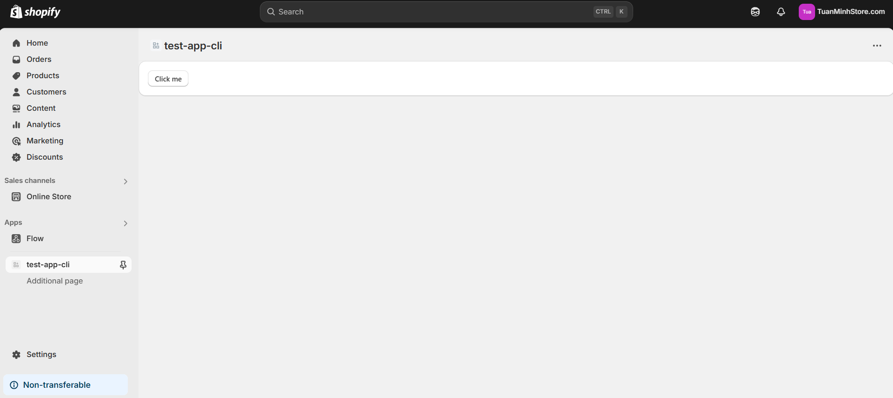
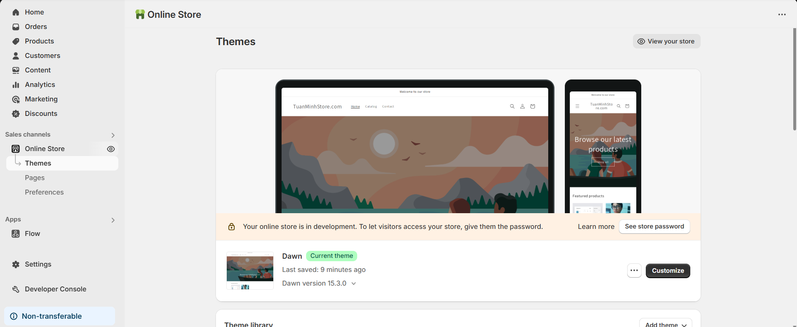
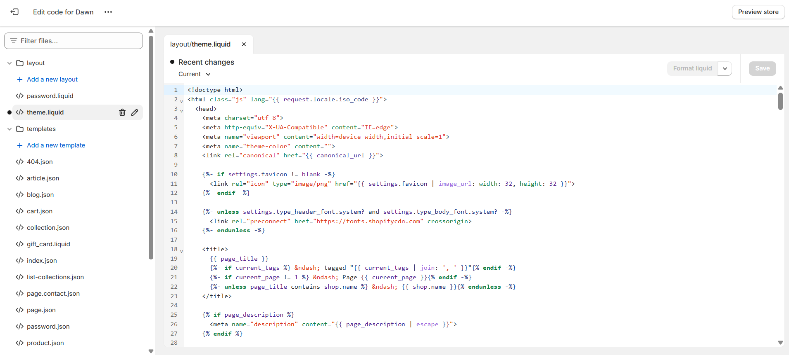
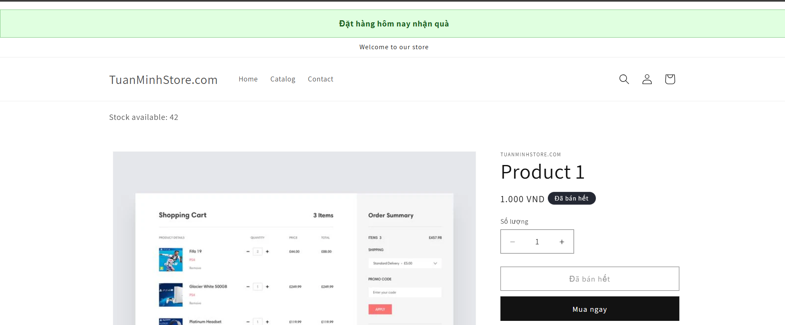

# Day 23:  Làm quen Shopify CLI & Tạo App Mẫu
## Nội dung chính
- Cài đặt Shopify CLI
- Khởi tạo Project App bằng CLI
- Tìm hiểu cấu trúc folder project


# Bài tập 
Tạo App mẫu chạy local
Cài Polaris hiển thị 1 UI component mẫu (Button, Card)

## 🗂️ Giải thích cấu trúc thư mục Shopify Remix App


```
test-app-cli/
├── .shopify/              ← Cấu hình nội bộ cho Shopify CLI
├── .vscode/               ← Cấu hình riêng của VS Code
├── app/                   ← Source code chính (Remix + React)
├── extensions/            ← Nơi chứa các App Extension (UI, Function,...)
├── node_modules/          ← Thư viện cài qua npm
├── prisma/                ← ORM cấu hình và schema DB (nếu bạn dùng Prisma)
├── public/                ← File tĩnh (ảnh, favicon,...) truy cập trực tiếp
├── .dockerignore          ← Bỏ qua file khi build Docker
├── .editorconfig          ← Định dạng editor đồng nhất
├── .eslintrc.cjs          ← Cấu hình ESLint (code style & kiểm tra lỗi)
├── .gitignore             ← Bỏ qua file khi commit Git
├── .graphqlrc.js          ← Cấu hình cho GraphQL (dev & test)
├── .npmrc                 ← Cấu hình npm (proxy, cache, registry,...)
├── Dockerfile             ← Cấu hình build Docker App (tuỳ chọn)
├── env.d.ts               ← Định nghĩa biến môi trường cho TypeScript
├── package.json           ← File khai báo dependency, script,...
├── remix.config.js        ← Cấu hình Remix framework
├── shopify.app.toml       ← Cấu hình app với Shopify (API key, scopes,...)
├── shopify.web.toml       ← Cấu hình dev preview (shop URL,...)
├── tsconfig.json          ← Cấu hình TypeScript
├── vite.config.ts         ← Cấu hình bundler Vite (dùng để build & hot reload)
```

📁 Chi tiết thêm thư mục quan trọng
🔸 /app/
Đây là nơi bạn viết code giao diện chính với Remix (React).

Thường có các folder:

routes/: khai báo route app (/, /products,...)

components/: các component dùng lại nhiều nơi (Button, Card,...)

🔸 /extensions/
Nếu bạn mở rộng app thành Shopify Function, Checkout UI extension,... chúng sẽ nằm ở đây.

Có thể được deploy riêng.

🔸 /prisma/
Dành cho cấu hình Prisma ORM (nếu app có truy cập DB).

Có file schema.prisma mô tả model và migration.

🔸 .shopify/
Shopify CLI tạo ra để lưu trạng thái app, tokens, dev config,...

## Bài tập



# Day 24: Shopify Theme & Storefront Interaction
## Nội dung chính
- Tổng quan Shopify Theme - Liquid, Sections, JSON Template
- Cách App tương tác với Storefront
- Cài đặt ScriptTag, App Block vào Theme
# Bài tập
## Inject 1 ScriptTag vào theme product page (hiển thị message "Đặt hàng hôm nay nhận quà")
## Thêm 1 App Block vào Product Page, hiển thị data từ App (ví dụ: tồn kho từ API riêng)

## 1, Liquid
Liquid là một ngôn ngữ template được phát triển bởi Shopify, giúp tạo ra các trang động và xử lý dữ liệu. Nó cho phép bạn truy xuất và hiển thị dữ liệu từ Shopify, như thông tin sản phẩm, đơn hàng, khách hàng, và nhiều thứ khác. Liquid được sử dụng để kết hợp HTML với dữ liệu động, ví dụ như hiển thị sản phẩm từ cơ sở dữ liệu Shopify.

## Các khái niệm cơ bản trong Liquid:
Variables (Biến): Dùng để lưu trữ và truy xuất giá trị.
```

```
## Filters (Bộ lọc): Dùng để thay đổi giá trị của một biến.
```
{{ product.title | upcase }} <!-- Chuyển tên sản phẩm thành chữ in hoa -->
```

## Tags (Thẻ): Dùng để thực thi logic, như vòng lặp hoặc điều kiện.
```

  <p>Sản phẩm có sẵn</p>

  <p>Sản phẩm hết hàng</p>

```

## Objects (Đối tượng): Dùng để truy xuất thông tin từ cửa hàng Shopify.
{{ product.title }} <!-- Hiển thị tên sản phẩm -->


## 2, Sections

Sections trong Shopify là các thành phần có thể tái sử dụng trong theme, cho phép người dùng tùy chỉnh các phần của trang như trang chủ, trang sản phẩm, trang giỏ hàng, v.v. Các Sections có thể được cấu hình từ giao diện quản trị của Shopify, giúp chủ cửa hàng dễ dàng thay đổi nội dung mà không cần phải chỉnh sửa code.

Các loại Sections:
- Static Sections (Section tĩnh): Những phần không thể thay đổi từ giao diện quản trị. Các sections này được cố định trong theme.

- Dynamic Sections (Section động): Những phần có thể được thêm vào hoặc di chuyển trong giao diện quản trị (có thể sử dụng các block tùy chỉnh).

Ví dụ về một section trong Liquid:
```

```

## 3, JSON Template
JSON Template là một định dạng cấu hình của Shopify Theme, cho phép bạn xác định cách bố trí và các Sections sẽ được tải trên các trang khác nhau của cửa hàng. Shopify sử dụng JSON để lưu trữ cấu trúc trang cho các loại trang khác nhau như trang chủ, trang sản phẩm, trang giỏ hàng, và các trang khác.

Cấu trúc JSON Template:
JSON Template giúp xác định các Sections và Block được sử dụng cho một trang cụ thể. Ví dụ, bạn có thể có một template cho trang sản phẩm, trong đó chứa các Sections như mô tả sản phẩm, hình ảnh sản phẩm, đánh giá sao, v.v.

Ví dụ về một JSON template cho trang sản phẩm:

```
{
  "sections": {
    "main-product": {
      "type": "main-product",
      "blocks": {
        "vendor": {
          "type": "text",
          "settings": {
            "text": "{{ product.vendor }}",
            "text_style": "uppercase"
          }
        },
        "title": {
          "type": "title",
          "settings": {}
        }
      },
      "settings": {
        "media_position": "left",
        "image_zoom": "lightbox"
      }
    }
  },
  "order": [
    "main-product"
  ]
}
```

sections: Định nghĩa các sections mà bạn muốn sử dụng trên trang này (ví dụ: main-product).

blocks: Định nghĩa các block bên trong mỗi section. Các block này có thể là văn bản, hình ảnh, đánh giá sản phẩm, v.v.

settings: Định nghĩa các cấu hình tùy chỉnh cho sections hoặc blocks, như vị trí media, kiểu hình ảnh, v.v.

order: Xác định thứ tự của các sections trên trang.
## 4. Kết hợp Liquid, Sections và JSON Template
Liquid giúp tạo ra các thành phần động trong theme, như hiển thị sản phẩm hoặc thông tin khách hàng.

Sections cung cấp các thành phần tùy chỉnh cho cửa hàng, giúp tạo ra các phần có thể thay đổi dễ dàng từ giao diện quản trị.

JSON Template giúp xác định cấu trúc của trang và kết hợp các sections và blocks để tạo thành giao diện hoàn chỉnh.

## Cách App tương tác với Storefront
1. App Block và App Extension
App Block và App Extension cho phép bạn tích hợp trực tiếp các ứng dụng của mình vào các trang của cửa hàng Shopify. Các ứng dụng này có thể thêm các thành phần giao diện như sản phẩm, khuyến mãi, đánh giá sản phẩm, và nhiều loại thông tin khác trực tiếp vào Storefront.

Cách thực hiện:
- App Block: Là một phần của ứng dụng mà bạn có thể chèn vào trang của cửa hàng như một block (phần tử) giao diện. Ví dụ: hiển thị đánh giá, thông tin khuyến mãi, hoặc hiển thị sản phẩm gợi ý.

- App Extension: Cho phép bạn tạo các phần tử tùy chỉnh có thể được thêm vào các trang Storefront thông qua giao diện quản trị Shopify.


## Cài đặt ScriptTag, App Block vào Theme

## 1. Cài đặt scriptTag
Bước 1: Vào online store:


Bước 2: Ấn vào dấu ... vào edit code


Bước 3: Sửa thêm script tag trong theme.liquid trong phần script

## Thêm App block
Bước 1: Chạy câu lệnh:
```
npm run shopify app generate extension
```
để tạo extention 

Bước 2: Thêm extention trong thư mục block

Bước 3: chạy
```
shopify app deploy
```
Bước 4: vào phần customize rồi add block


# Demo


