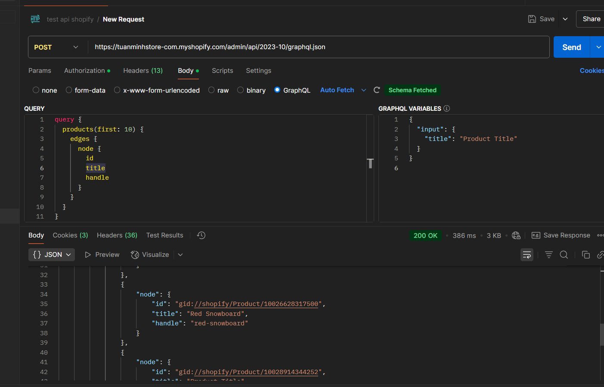
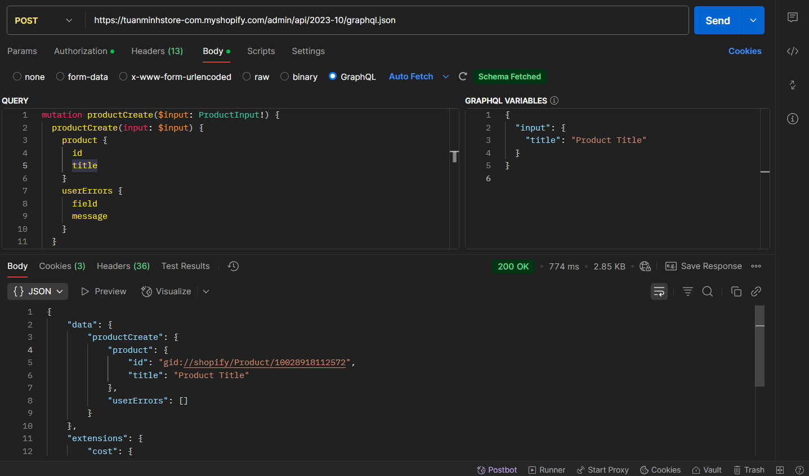

# Day 25: OAuth Flow & Admin API
## Nội dung chính
- Hiểu được OAuth 2.0 flow trong Shopify App
- Lấy access token thủ công
- Gọi thử các API như: GET /admin/api/2024-01/products.json
- Nắm rõ cơ chế xác thực, bảo mật của Shopify App


## OAuth 2.0 flow trong Shopify App

OAuth 2.0 là giao thức ủy quyền mà Shopify sử dụng để cấp quyền cho các ứng dụng bên ngoài (third-party apps) truy cập vào cửa hàng của người dùng mà không cần yêu cầu họ cung cấp thông tin đăng nhập của mình. Quy trình OAuth trong Shopify giúp bảo vệ quyền riêng tư của người dùng và đảm bảo tính bảo mật.

Quy trình OAuth 2.0 trong Shopify App:
1, Chuyển hướng người dùng đến trang đăng nhập Shopify:

- Ứng dụng của bạn sẽ gửi người dùng đến trang ủy quyền của Shopify để họ xác nhận việc cấp quyền cho ứng dụng.

- Shopify yêu cầu người dùng đăng nhập và cấp phép cho các quyền (scopes) mà ứng dụng yêu cầu.

URL yêu cầu OAuth:
```
https://accounts.shopify.com/oauth/authorize?client_id=YOUR_CLIENT_ID&redirect_uri=YOUR_REDIRECT_URI&response_type=code&scope=YOUR_SCOPES&state=YOUR_STATE
```
Các tham số:

- client_id: Mã của ứng dụng bạn trên Shopify.

- redirect_uri: Địa chỉ bạn muốn Shopify chuyển hướng về sau khi người dùng cấp phép.

- response_type=code: Bạn yêu cầu mã xác thực.

- scope: Các quyền mà ứng dụng yêu cầu, ví dụ: read_products, write_orders, read_customers.

- state: Một chuỗi ngẫu nhiên giúp bảo vệ chống lại các cuộc tấn công CSRF.

2, Nhận mã xác thực (Authorization Code):
Sau khi người dùng cho phép, Shopify sẽ chuyển hướng họ về redirect_uri kèm theo mã xác thực (code).

3, Lấy access token từ mã xác thực:
Bạn sử dụng mã xác thực để lấy access_token, cho phép ứng dụng của bạn truy cập dữ liệu từ Shopify.

Yêu cầu POST tới Shopify:
```
POST https://{your-shop-name}.myshopify.com/admin/oauth/access_token
```

## Lấy Access Token Thủ Công

Để lấy access token thủ công, bạn cần làm theo các bước sau sau khi có mã xác thực từ Shopify:

- Gửi một yêu cầu POST tới endpoint https://{your-shop-name}.myshopify.com/admin/oauth/access_token với client_id, client_secret, code, và redirect_uri của bạn.

- Shopify sẽ trả về một access_token, bạn sẽ dùng token này để thực hiện các API call.

## Gọi thử các API:


