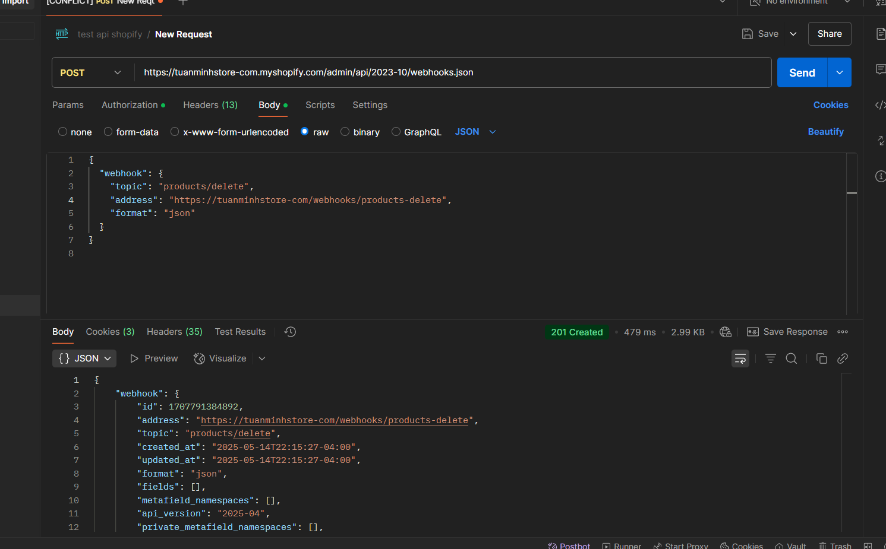
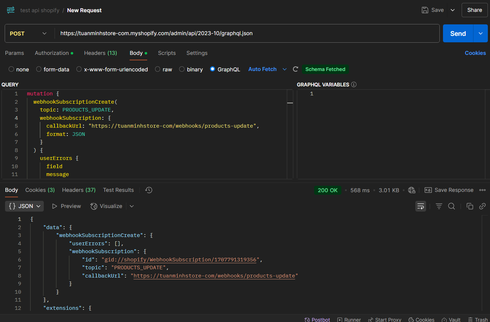
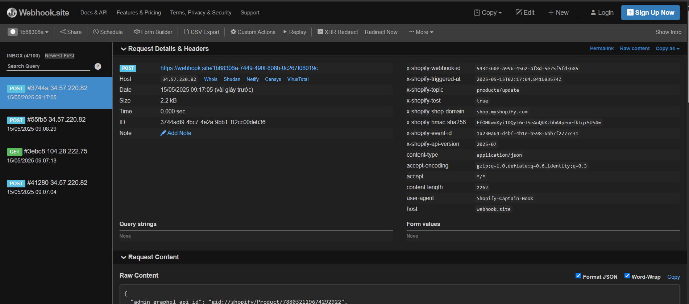
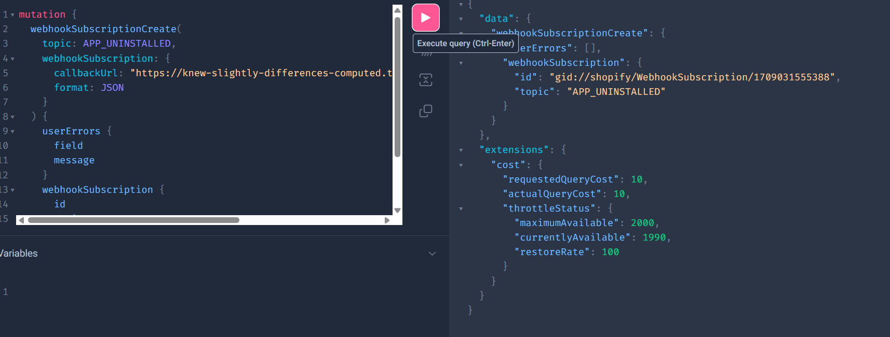

# Day 27: Shopify Webhooks
## Nội dung chính
- Tổng quan về Webhook trong Shopify
- Đăng ký webhook (REST & GraphQL)
- Xử lý webhook trong Remix App
- Các webhook quan trọng: orders/create, app/uninstalled
## Bài tập
- Đăng ký webhook orders/create
- Log dữ liệu webhook nhận được ra console

# 1, Lý thuyết 

## TỔng quan về webhook
🧠 1. Webhook là gì?
Webhook là một cơ chế "push" dữ liệu tự động từ hệ thống A đến hệ thống B khi một sự kiện xảy ra. Nó hoạt động như một callback URL mà hệ thống gốc gọi đến khi có cập nhật mới.

Khác với API polling (kéo), webhook là real-time và tiết kiệm tài nguyên hơn.

Ví dụ:
Khi có một đơn hàng mới, Shopify sẽ gửi dữ liệu đơn hàng đến một URL webhook mà bạn đã đăng ký.


🔄 2. Cơ chế hoạt động của Webhook
Bước 1: Bạn đăng ký một webhook trên hệ thống nguồn (Shopify, GitHub, Stripe,...)

Bước 2: Khi có sự kiện diễn ra (VD: order created), hệ thống sẽ gửi một HTTP POST request đến endpoint mà bạn chỉ định.

Bước 3: Server bạn nhận dữ liệu và xử lý logic (gửi email, lưu DB, gửi thông báo...)

Bước 4: Server trả về mã 200 OK nếu nhận và xử lý thành công

```
Shopify --> [Gửi POST JSON] --> https://yourdomain.com/webhook/order
                                    ↑
                             Xác minh HMAC
```

📥 3. Cấu trúc một webhook request

Khi webhook được kích hoạt, hệ thống gửi một HTTP POST với:

Headers:

```
Content-Type: application/json

X-Signature hoặc X-Hub-Signature (để xác minh)

User-Agent, v.v.
```

Body: JSON chứa thông tin sự kiện
```
{
  "id": "evt_123456",
  "type": "payment_intent.succeeded",
  "data": {
    "object": {
      "amount": 2000,
      "currency": "usd"
    }
  }
}
```
## Đăng ký webhook (REST & GraphQL)
a, REST 
Endpoint: 
```
https://${shop-name}.myshopify.com/admin/api/2023-10/webhooks.json
X-Shopify-Access-Token: <access_token>
Content-Type: application/json
```
Body:
```
{
  "webhook": {
    "topic": "products/create",
    "address": "https://${shop-name}/webhooks/products-create",
    "format": "json"
  }
}
```


b, Graphql
```
POST https://{shop}.myshopify.com/admin/api/2023-10/graphql.json
Headers:
  X-Shopify-Access-Token: <access_token>
  Content-Type: application/json
```

```
mutation {
  webhookSubscriptionCreate(
    topic: PRODUCTS_CREATE,
    webhookSubscription: {
      callbackUrl: "https://tuanminhstore-com/webhooks/products-create",
      format: JSON
    }
  ) {
    userErrors {
      field
      message
    }
    webhookSubscription {
      id
      topic
      callbackUrl
    }
  }
}

```


Test: 



# Bài tập
## Đăng ký webhook orders/create



## Log dữ liệu webhook nhận được ra console


