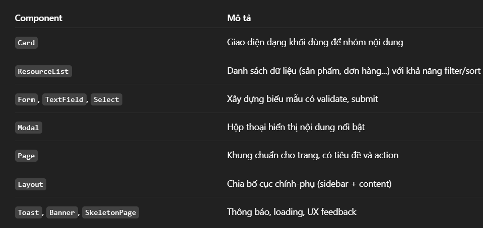
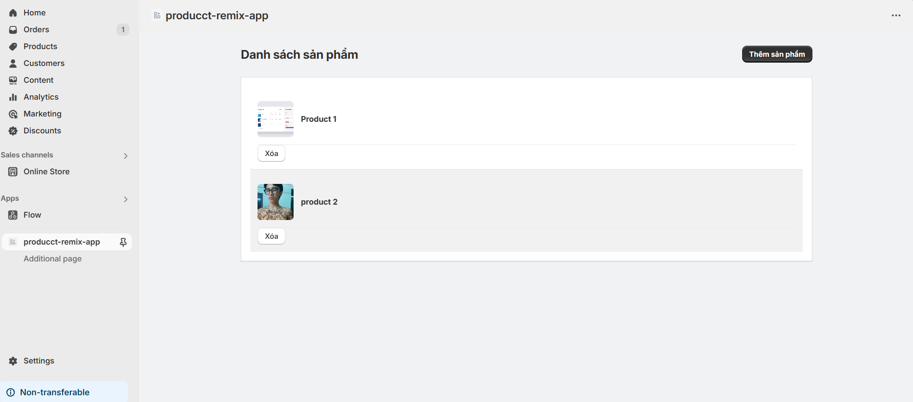

# Day 28:  Shopify Polaris & UI Advanced
## Nội dung chính
- Tìm hiểu Polaris Design System
- Các component quan trọng (Card, ResourceList, Form, Modal…)
- Kết hợp Polaris + Remix để build UI

# Bài tập
- Render danh sách Product bằng Polaris ResourceList
- Thêm Button thêm/xóa product giả lập

## Lý thuyết
## 1. Tìm hiểu Shopify Polaris Design System
Polaris là gì?
Là Design System chính thức của Shopify.

Cung cấp các React component có sẵn, giúp xây dựng UI thống nhất với Shopify Admin.

Bao gồm cả hướng dẫn về UI/UX, tone of voice, accessibility...

2. Các Component quan trọng trong Polaris


3. Tích hợp Polaris với Remix để build UI

Bước 1: 
```
npm install @shopify/polaris
```

Bước 2: 
```
import '@shopify/polaris/build/esm/styles.css';
```

Bước 3: Bọc app với AppProvider
```
import { AppProvider } from '@shopify/polaris';

export default function App() {
  return (
    <AppProvider i18n={{}}>
      <Outlet />
    </AppProvider>
  );
}
```
Bài tập:
Demo giao diện: 



