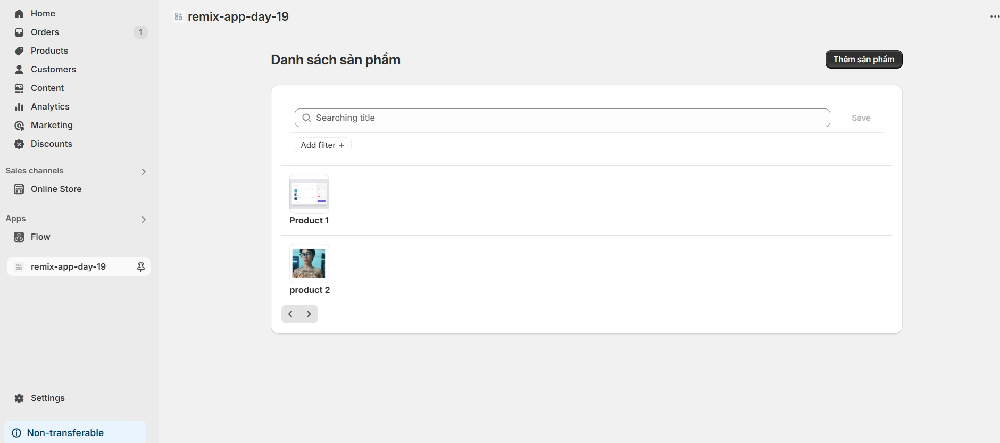
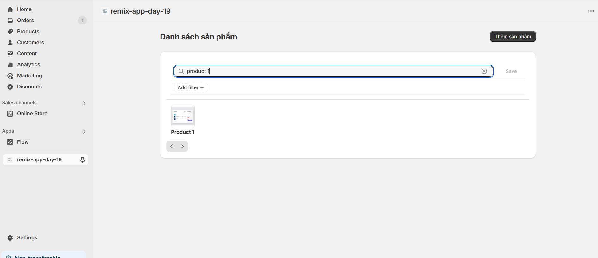

# Day 29-30: Shopify React Hooks + API Admin nâng cao
## Nội dung chính
- Shopify useAppBridge, useAuthenticatedFetch
- Call Shopify Admin API qua App Bridge
- Pagination / Filter / Query param

# Bài tập
- Tạo trang /admin-products
- Call thật Shopify Admin API (GraphQL)
- Hiển thị danh sách sản phẩm có filter theo title


## Lý thuyết 
1. Tìm hiểu useAppBridge và useAuthenticatedFetch

## useAppBridge
- Hook để lấy ra App Bridge instance – bắt buộc có khi gọi API Shopify qua Proxy.

- App Bridge là SDK giúp app tích hợp sâu với Shopify Admin (UI, API, Auth…)

```
import { useAppBridge } from "@shopify/app-bridge-react";

const app = useAppBridge();
```

## useAuthenticatedFetch

Mục đích
- Gửi request đến Shopify Admin API thông qua proxy backend của app.

- Đảm bảo yêu cầu chứa token hợp lệ, đúng shop, đúng phiên đăng nhập.

- Bảo mật: tránh lộ token ở phía frontend
```
import { useAuthenticatedFetch } from "~/hooks";

const fetch = useAuthenticatedFetch();

useEffect(() => {
  fetch("/api/products")
    .then((res) => res.json())
    .then((data) => console.log(data));
}, []);
```

# Bài tập

Giao diện: 

filter theo tên:



