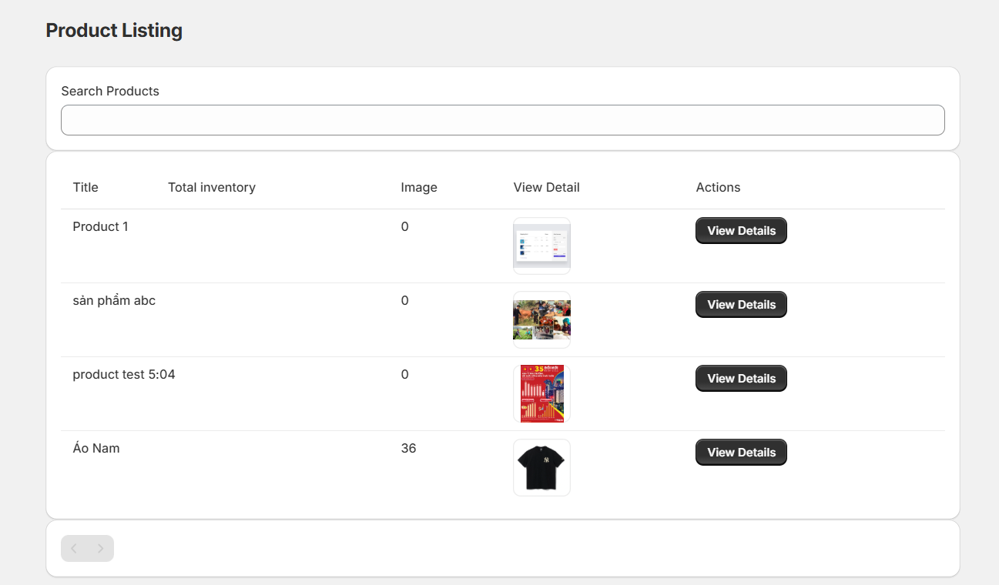
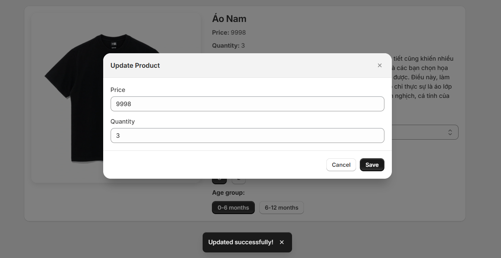
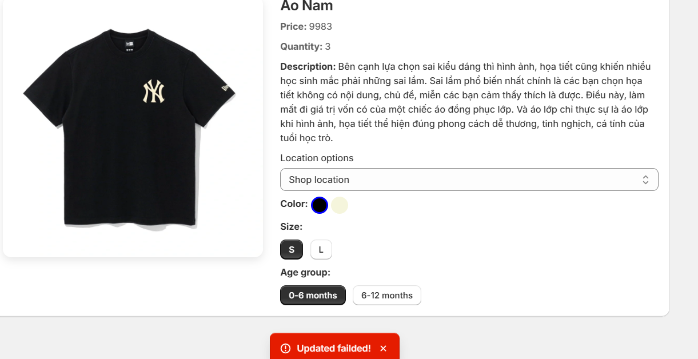
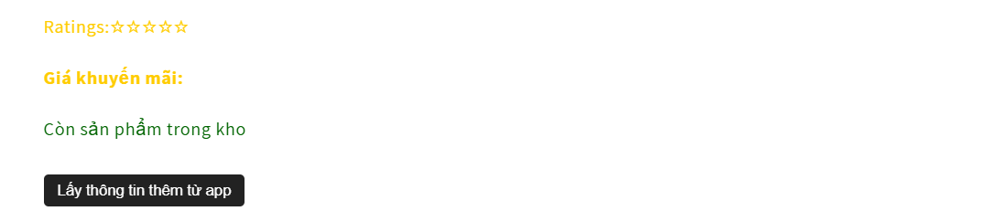
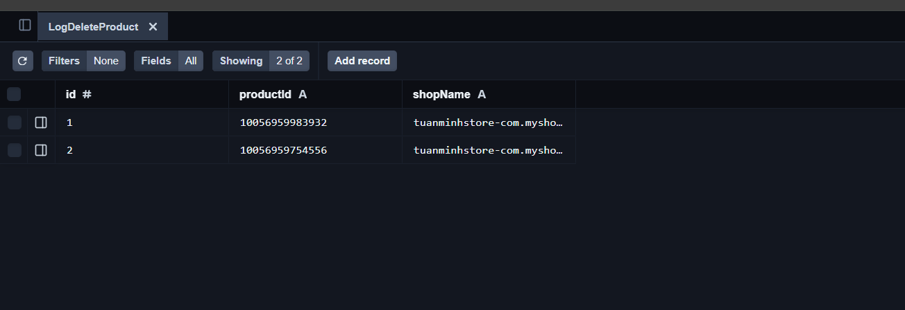
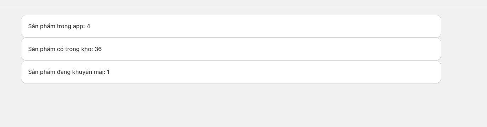

# Tuần 7 & Tuần 8: Project - Shopify App Hoàn chỉnh
# Xây dựng Shopify App - "Product Promotion & Stock Manager"

## Mục tiêu: Xây dựng 1 Shopify Embedded App có khả năng:
- Hiển thị danh sách sản phẩm từ Shopify
- Cập nhật thông tin sản phẩm (giá khuyến mãi / tồn kho)
- Tương tác với Shopify Theme (App Block / ScriptTag)
- Có trang Dashboard sử dụng Polaris
- Xử lý Webhook khi sản phẩm bị xoá
- Validate input, handle error
- Có chức năng OAuth đầy đủ

# 1 Authentication & OAuth

Triển khai OAuth flow chuẩn
Lưu token vào DB (SQLite/MySQL)
Middleware check token cho toàn bộ API
(Phần này remix đã xử lý sẵn nên chỉ cần hiểu luồng)

# 2 Product Listing - Sử dụng Shopify Admin API

Gọi API lấy danh sách sản phẩm
Hiển thị bảng danh sách (Polaris DataTable)
Xem chi tiết từng sản phẩm
Bonus: Thêm phân trang / tìm kiếm

# 3 Product Update - Giá & Tồn kho

Form update giá giảm / tồn kho
Validate đầu vào (middleware)
Call API Shopify để cập nhật
Show Toast Polaris khi thành công / thất bại

# 4 Theme Interaction - App Block hoặc ScriptTag

App cho phép inject App Block vào Product Page
Nội dung hiển thị:
Giá gốc
Giá khuyến mãi
Thông điệp "Còn X sản phẩm trong kho"
Có nút call API riêng lấy dữ liệu dynamic từ app (không chỉ lấy từ Shopify)

# 5 Webhook - Product Delete

Đăng ký webhook PRODUCT_DELETE
Khi sản phẩm bị xoá => log ra file hoặc ghi vào database

# 6 Dashboard thống kê (Polaris)

Số sản phẩm đang có trong app
Tổng tồn kho các sản phẩm
Tổng sản phẩm đang giảm giá

